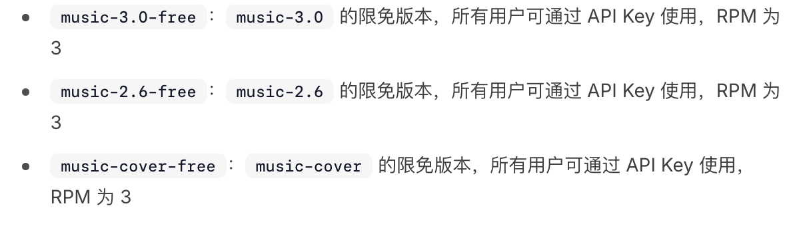

<!-- 在这里开始写正文。标准 Markdown 语法，保存后 pnpm dev 即可预览。 -->
最近经常在视频号上刷到一些视频，包含了许多关于程序员日常崩溃（如单点登录、接口对接、localhost 上线等）的爆笑对话内容。而且感觉这种视频都还批量生成的，内容和画面都很有规律。于是我就想，能不能用 AI 来生成这种视频呢？于是我就尝试了用 [minimax](https://www.minimax.com/) 来生成音乐。

minimax 提供一些免费的音乐生成模型。

<!-- 插图：图片放进 src/content/blog/minimax-music-gen/，用  引用，Astro 会自动压缩优化。 -->

果断 vibe coding 了一个网页，方便于一键生成音乐，为之后的生成视频做准备。意外发现生成的音乐还蛮好听的。

网站放到 github page 上了。地址是 [https://supertiny99.github.io/minimax-music-studio/](https://supertiny99.github.io/minimax-music-studio/) 。

